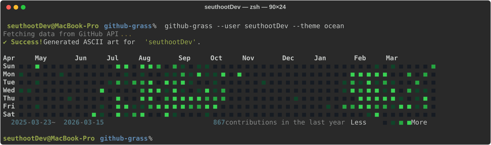

# GitHub README Insight Terminal ASCII

A tool to generate **terminal-style ASCII SVGs** from your GitHub profile contribution data.  
Like [github-readme-stats](https://github.com/anuraghazra/github-readme-stats), you can embed it in your README or GitHub profile with a single URL.

- **Themes**: macOS Terminal / Windows PowerShell / Ubuntu GNOME styles
- **CLI**: Run locally to print to terminal and save SVG
- **API**: Returns SVG via `GET /svg?user=USER&theme=...` (default graph) or `GET /svg/:type?user=USER&theme=...`
- **Tooltip**: Hover each cell to see date and contribution count

**theme=mac** — macOS Terminal (zsh)



**theme=window** — Windows PowerShell



**theme=ubuntu** — Ubuntu GNOME Terminal



**Stats previews (mac / window / ubuntu)**





**top-lang previews (mac / window / ubuntu)**




---

## Introduction

- Enter a GitHub username to fetch the **last year's contribution data** and render a contribution grid.
- Renders a terminal-style SVG directly in Node.js, including hover tooltips with **date and contribution count**.
- Each theme has a distinct terminal window style (title bar, controls, and background colors).

---

## Local Usage

### CLI (Run without a server)

Prints the contribution graph in your terminal and saves SVG output in the current directory.

```bash
npm install
npm run cli -- --user YOUR_GITHUB_ID --theme mac
```

**Options**

| Option | Required | Description |
|--------|----------|-------------|
| `--user` | ✅ | GitHub User ID |
| `--theme` | ❌ (Default: mac) | `mac` / `window` / `ubuntu` |
| `--output` | ❌ (Default: `{theme}_style.svg`) | Output file name |

**Examples**

```bash
npm run cli -- --user seuthootdev --theme mac
npm run cli -- --user torvalds --theme ubuntu --output ubuntu_style.svg
```

### API Local Testing

Run the local API server for browser/README URL testing:

```bash
npm install
npm run serve
```

- Browser (graph): `http://127.0.0.1:8000/svg?user=YOUR_GITHUB_ID&theme=mac`
- Browser (typed route): `http://127.0.0.1:8000/svg/graph?user=YOUR_GITHUB_ID&theme=mac`
- Browser (stats): `http://127.0.0.1:8000/svg/stats?user=YOUR_GITHUB_ID&theme=mac`
- Browser (top-lang): `http://127.0.0.1:8000/svg/top-lang?user=YOUR_GITHUB_ID&theme=mac&top=8`
- Test with `mac`, `window`, and `ubuntu` themes.

---

## Embedding in GitHub Profile / README

Use the deployed API URL as your image source.

**URL Format**

```
https://github-readme-insight-terminal-asci.vercel.app/svg?user=GITHUB_USERNAME&theme=THEME
https://github-readme-insight-terminal-asci.vercel.app/svg/graph?user=GITHUB_USERNAME&theme=THEME
https://github-readme-insight-terminal-asci.vercel.app/svg/stats?user=GITHUB_USERNAME&theme=THEME
https://github-readme-insight-terminal-asci.vercel.app/svg/top-lang?user=GITHUB_USERNAME&theme=THEME&top=8
```

| Query | Required | Description |
|-------|----------|-------------|
| `user` | ✅ | GitHub Username |
| `theme` | ❌ (Default: mac) | `mac` / `window` / `ubuntu` |
| `top` | ❌ (top-lang only, Default: 6) | `6` to `12` |
| `scale` | ❌ (Default: 1) | Uniform size multiplier (`0.2` to `3`) |


**Markdown Example**

```markdown


```

---

## Deployment

This project is deployed via **Vercel**.

---

## Contributing

Contributions such as bug reports, new themes, and documentation/code improvements are welcome.

1. Fork this repository.
2. Create a branch (`git checkout -b feature/your-feature`).
3. Commit and push your changes.
4. Open a Pull Request.
