# GitHub README Insight Terminal ASCII

[](https://www.npmjs.com/package/github-readme-insight-terminal-ascii)
[](https://github.com/seuthootDev/github-readme-insight-terminal-ascii/stargazers)
[](LICENSE)
[](https://github-readme-insight-terminal-asci.vercel.app)
[](https://github.com/seuthootDev/github-readme-insight-terminal-ascii/commits/main)

A tool to generate **terminal-style ASCII SVGs** from your GitHub profile data.  
Like [github-readme-stats](https://github.com/anuraghazra/github-readme-stats), you can embed it in your README or GitHub profile with a single URL.

- **Themes**: macOS Terminal / Windows PowerShell / Ubuntu GNOME
- **Types**: contribution graph · stats · top languages · streak · ASCII avatar · GitHub neofetch
- **CLI**: Run locally to print the graph and save SVG
- **API**: `GET /svg?user=USER&theme=...` (default graph) or `GET /svg/:type?user=USER&theme=...`
- **Tooltip**: Hover contribution cells to see date and count

**theme=mac** — macOS Terminal (zsh)


**theme=windows** — Windows PowerShell


**theme=ubuntu** — Ubuntu GNOME Terminal


**Stats**


**Top languages**


**Streak** — current / longest contribution streak





**ASCII avatar** (mono / color)




**GitHub neofetch** — Octocat ASCII + profile fields (Repos, Stars, Contributions, …)


---

## Introduction

Pass a GitHub username to fetch profile data and render a terminal-style SVG in Node.js.

| Type | What it shows |
|------|----------------|
| `graph` | Contribution calendar (hover tooltips) |
| `stats` | Stars, PRs, issues, yearly contributions |
| `top-lang` | Most used languages |
| `streak` | Current streak, longest streak, and total contributions |
| `ascii` | Profile photo as ASCII art |
| `neofetch` | GitHub “neofetch” card — Octocat ASCII + fields like Name, Repos, Followers, Stars, Contributions, Languages |

A **streak** is how many days in a row you've had at least one contribution — like a Duolingo streak, but for commits. `streak` shows your current streak (counting from today, or yesterday if today has no contributions yet), your longest streak ever, and total contributions, all computed from the last year of contribution data.

Themes only change the terminal chrome (title bar, controls, colors).

---

## Local Usage

### CLI

Prints the contribution graph in your terminal and saves an SVG.

```bash
npm install
npm run cli -- --user YOUR_GITHUB_ID --theme mac
```

| Option | Required | Description |
|--------|----------|-------------|
| `--user` | ✅ | GitHub username |
| `--theme` | ❌ (default: `mac`) | `mac` / `windows` / `ubuntu` |
| `--output` | ❌ | Output file (default: `{theme}_style.svg`) |

```bash
npm run cli -- --user seuthootdev --theme mac
npm run cli -- --user torvalds --theme ubuntu --output ubuntu_style.svg
```

### API

```bash
npm install
npm run serve
```

| Type | URL |
|------|-----|
| graph | `http://127.0.0.1:8000/svg?user=YOUR_GITHUB_ID&theme=mac` |
| graph | `http://127.0.0.1:8000/svg/graph?user=YOUR_GITHUB_ID&theme=mac` |
| stats | `http://127.0.0.1:8000/svg/stats?user=YOUR_GITHUB_ID&theme=mac` |
| top-lang | `http://127.0.0.1:8000/svg/top-lang?user=YOUR_GITHUB_ID&theme=mac&top=8` |
| streak | `http://127.0.0.1:8000/svg/streak?user=YOUR_GITHUB_ID&theme=mac` |
| ascii | `http://127.0.0.1:8000/svg/ascii?user=YOUR_GITHUB_ID&theme=mac` |
| ascii (color) | `http://127.0.0.1:8000/svg/ascii?user=YOUR_GITHUB_ID&theme=mac&color=1` |
| neofetch | `http://127.0.0.1:8000/svg/neofetch?user=YOUR_GITHUB_ID&theme=mac&color=1` |

---

## Embedding in GitHub Profile / README

```
https://github-readme-insight-terminal-asci.vercel.app/svg?user=GITHUB_USERNAME&theme=THEME
https://github-readme-insight-terminal-asci.vercel.app/svg/graph?user=GITHUB_USERNAME&theme=THEME
https://github-readme-insight-terminal-asci.vercel.app/svg/stats?user=GITHUB_USERNAME&theme=THEME
https://github-readme-insight-terminal-asci.vercel.app/svg/top-lang?user=GITHUB_USERNAME&theme=THEME&top=8
https://github-readme-insight-terminal-asci.vercel.app/svg/streak?user=GITHUB_USERNAME&theme=THEME
https://github-readme-insight-terminal-asci.vercel.app/svg/ascii?user=GITHUB_USERNAME&theme=THEME
https://github-readme-insight-terminal-asci.vercel.app/svg/ascii?user=GITHUB_USERNAME&theme=THEME&color=1
https://github-readme-insight-terminal-asci.vercel.app/svg/neofetch?user=GITHUB_USERNAME&theme=THEME&color=1
```

| Query | Required | Description |
|-------|----------|-------------|
| `user` | ✅ | GitHub username |
| `theme` | ❌ (default: `mac`) | `mac` / `windows` / `ubuntu` |
| `top` | ❌ (`top-lang` only, default: `6`) | `6`–`12` |
| `color` | ❌ (`ascii` / `neofetch`, default: mono) | `1` / `true` / `color` |
| `cols` | ❌ (`ascii` only, default: `50`) | ASCII width `24`–`140` |
| `scale` | ❌ (default: `1`, ascii: `0.28`) | Size multiplier `0.05`–`3` |

```markdown


```

---

## Deployment

Deployed on **Vercel**.

---

## Contributing

Bug reports, new themes, and docs/code improvements are welcome.

1. Fork this repository.
2. Create a branch (`git checkout -b feature/your-feature`).
3. Commit and push your changes.
4. Open a Pull Request.

---

## More from the same author

Like terminal ASCII cards? These sister projects turn GitHub activity into **zodiac profile cards** — embed as SVG in your README, or pin a Gist (productive-box style).

### [github-readme-zodiac](https://github.com/seuthootDev/github-readme-zodiac)

Western zodiac cards from your GitHub stats — constellation art, traits like Consistency / Builder, SVG or pinned Gist.


```md

```

### [github-readme-chinese-zodiac](https://github.com/seuthootDev/github-readme-chinese-zodiac)

Asian zodiac (生肖) cards — the 12 animals, SVG or pinned Gist, same GitHub signals with Asian-flavored trait names.


```md

```
